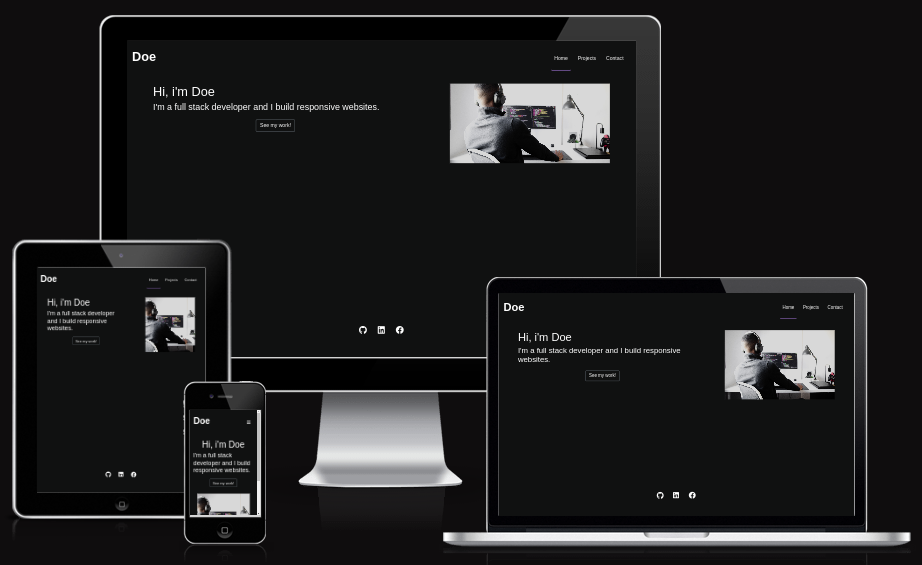
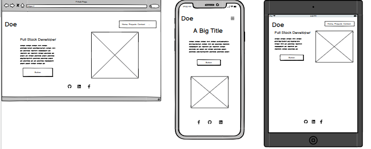
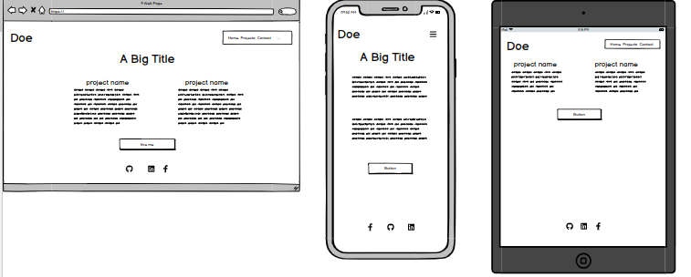
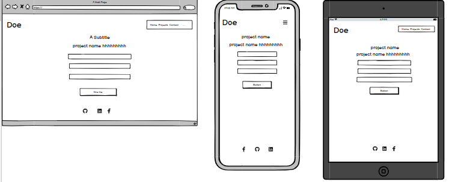
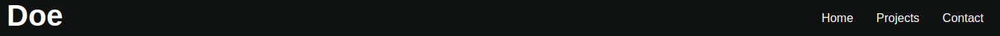
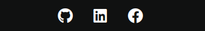
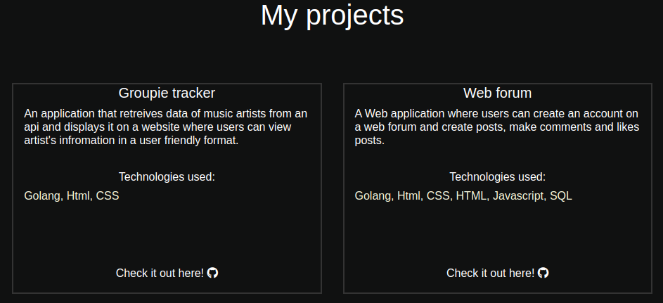
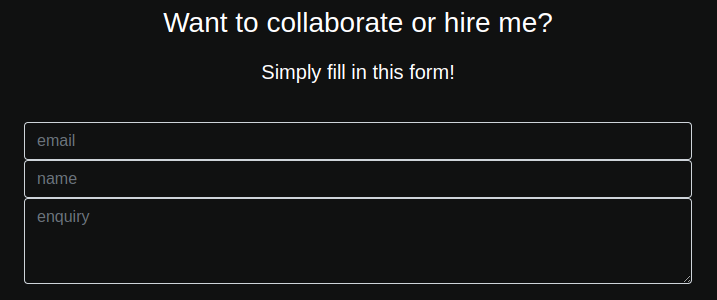

# CI-TS-shoswcase

Showcase is a portfolio site that displays a full stack developer's skills to potential employers who are seeking to hire a full stack developer. Contact information is also provided for users who wish to collaborate with the developer.

## Index – Table of Contents
* [User Experience (UX)](#user-experience-ux)
* [Features](#features)
* [Design](#design)
* [Technologies Used](#technologies-used)
* [Testing](#testing)
* [Deployment](#deployment)
* [Credits](#credits)

## User Experience (UX) 

### User Stories

#### First Time Visitor Goals

  - I want to easily be able to contact the developer to collaborate with them 
  - I want to see the developers skills and experience

####  Returning visitor goals

  - As a returning visitor, I want to quickly navigate through the site

## Technologies Used

### Languages Used

-   [HTML5](https://en.wikipedia.org/wiki/HTML5)
-   [CSS3](https://en.wikipedia.org/wiki/Cascading_Style_Sheets)

### Frameworks, Libraries & Programs Used

-   [Bootstrap:](https://getbootstrap.com/) used to make the site responsive
-   [Font Awesome:](https://fontawesome.com/) used to add icons for aesthetic and UX purposes.
-   [Git:](https://git-scm.com/) used for version control.
-   [GitHub:](https://github.com/) used as the remote respository for the project.
-   [Balsamiq:](https://balsamiq.com used to create the wireframes during the design process.

## Design

### Wireframes

- #### main page wireframes.

  

- #### projects page wireframes

  

- #### contact page wireframes

  

## Features

### Existing Features

- __Navigation Bar__

  - Featured on all three pages, the full responsive navigation bar includes links to the Home page, projects and Contact page and is identical in each page to allow for easy navigation.

 
 
- __The landing page image__

  - The landing includes a photograph of the developer, giving the user an idea of who they are

- __The Footer__ 

  - The footer section includes links to the relevant social media sites for the developer. The links will open to a new tab to allow easy navigation for the user. 
  - The footer encourages users to stay connected via social media.

- __The Projects Page__

  - The projects page provides overviews on some of the developer's projects. 

- __The Contact Page__

  - This page allows users to contact the developer for inquiries about collaboration and shows interest for employers. 

## Testing 

### Browser Testing

No issues when testing the site's responsiveness on firefox and chrome using the browser's developer tools

### Validator Testing 

- HTML
  - No errors were returned when passing through the official [W3C validator](https://validator.w3.org/)
- CSS
  - No errors were found when passing through the official [(Jigsaw) validator](https://jigsaw.w3.org/css-validator/)

## Deployment

- The site was deployed to GitHub pages. The steps to deploy are as follows: 
  - In the GitHub repository, navigate to the Settings tab 
  - From the source section drop-down menu, select the Main Branch if not already selected
  - Once the main branch has been selected, the page will be automatically refreshed with a detailed ribbon display to indicate the successful deployment. 

The live link can be found [here](https://t-sacko.github.io/CI-1/)

## Known issues

 - Couldn't use lighthouse for testing as it wasnt loading for me

## Credits 

### code

- I learned how to use flexboxes with [flexbox froggy](https://flexboxfroggy.com/)

### Content 

- The icons on the page were taken from [Font Awesome](https://fontawesome.com/)

### Media

- The image used on the home and sign up page are from [This Open Source site](https://unsplash.com/)

### Acknowledgements

- Special thanks to [code institute](https://codeinstitute.net/) for providing the learning resources I needed to complete this project